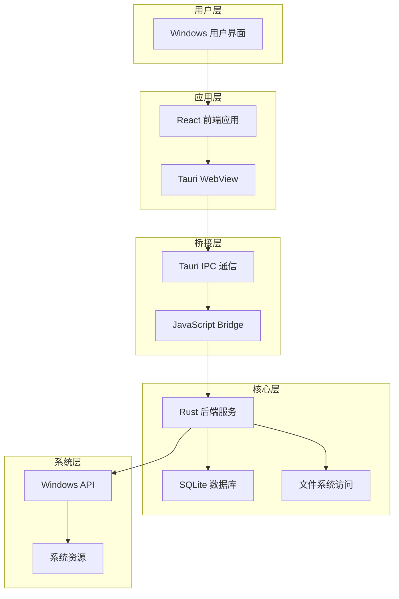
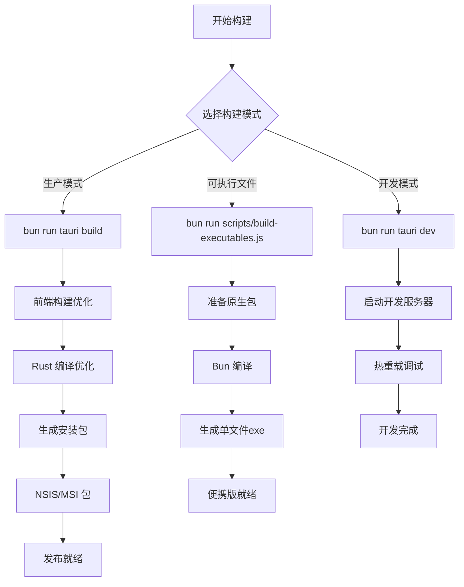
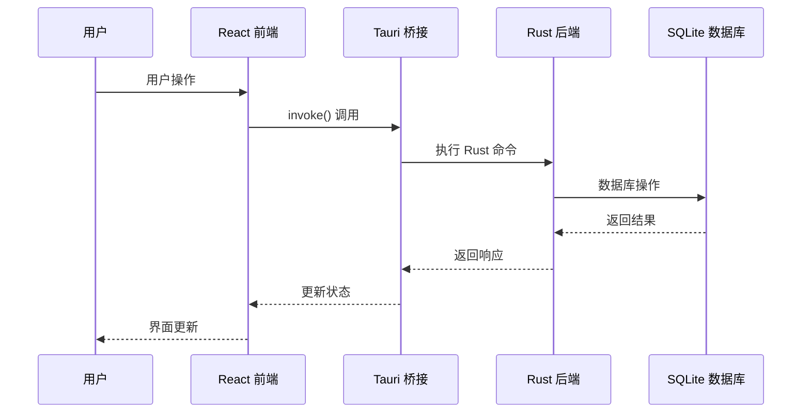

# Claude Suite Windows 构建设计文档

## 1. 整体架构设计

### 1.1 系统分层架构


### 1.2 构建流程设计


## 2. 模块设计与接口规范

### 2.1 前端模块设计
- **组件架构**: React 18 + TypeScript
- **状态管理**: React Context + Hooks
- **UI框架**: Tailwind CSS 4 + Radix UI
- **构建工具**: Vite 6.0+

### 2.2 后端模块设计
- **核心框架**: Tauri 2.x
- **数据存储**: SQLite (嵌入式)
- **进程管理**: Tokio 异步运行时
- **系统集成**: Windows API 调用

### 2.3 接口契约定义
```rust
// Tauri 命令接口示例
#[tauri::command]
async fn get_projects() -> Result<Vec<Project>, String> {
    // 获取项目列表的实现
}

#[tauri::command]
async fn create_project(name: String, path: String) -> Result<Project, String> {
    // 创建新项目的实现
}
```

## 3. 数据流向设计

### 3.1 用户交互流


### 3.2 文件系统访问流


## 4. 异常处理策略

### 4.1 错误分类
1. **编译时错误**
   - 依赖缺失
   - 版本不兼容
   - 配置错误

2. **运行时错误**
   - 权限不足
   - 文件访问失败
   - 网络连接问题

3. **用户操作错误**
   - 无效输入
   - 操作冲突
   - 资源不足

### 4.2 错误处理机制
```rust
// 统一错误处理示例
#[derive(Debug, thiserror::Error)]
pub enum AppError {
    #[error("数据库错误: {0}")]
    Database(#[from] rusqlite::Error),
    
    #[error("文件系统错误: {0}")]
    FileSystem(#[from] std::io::Error),
    
    #[error("配置错误: {message}")]
    Config { message: String },
}
```

## 5. 性能优化设计

### 5.1 编译优化配置
```toml
[profile.release]
opt-level = "z"     # 体积优化
lto = true          # 链接时优化
codegen-units = 1   # 减少并行编译单元
panic = "abort"     # 异常时直接终止
strip = true        # 移除调试符号
```

### 5.2 运行时优化
- **内存管理**: Rust 零成本抽象
- **异步处理**: Tokio 高效异步运行时
- **数据库**: SQLite 连接池和预编译语句
- **UI渲染**: WebView2 硬件加速

## 6. 安全设计

### 6.1 权限控制
- **文件系统访问**: 基于 Tauri 权限系统
- **网络访问**: 白名单机制
- **进程执行**: 受限的命令执行

### 6.2 数据保护
- **本地存储**: 加密敏感配置
- **通信安全**: IPC 消息验证
- **输入验证**: 前后端双重验证

## 7. 构建产物规范

### 7.1 开发模式产物
- **目标**: 开发调试
- **位置**: `src-tauri/target/debug/`
- **特点**: 包含调试信息，未优化

### 7.2 生产模式产物
- **NSIS 安装包**: `src-tauri/target/release/bundle/nsis/`
- **MSI 安装包**: `src-tauri/target/release/bundle/msi/`
- **可执行文件**: `src-tauri/target/release/`

### 7.3 单文件可执行产物
- **位置**: `src-tauri/binaries/`
- **命名**: `claude-code-x86_64-pc-windows-msvc.exe`
- **特点**: 自包含，无需安装

## 8. 质量保证

### 8.1 自动化测试
- **单元测试**: Rust 后端逻辑测试
- **集成测试**: 前后端交互测试
- **端到端测试**: 完整用户流程测试

### 8.2 代码质量
- **Linting**: ESLint + Clippy
- **格式化**: Prettier + rustfmt
- **类型检查**: TypeScript + Rust 编译器

### 8.3 性能基准
- **启动时间**: < 3秒
- **内存占用**: < 200MB (空闲状态)
- **安装包大小**: < 50MB

---

**设计版本**: v1.0  
**创建日期**: 2025-01-28  
**审查状态**: 待审批
