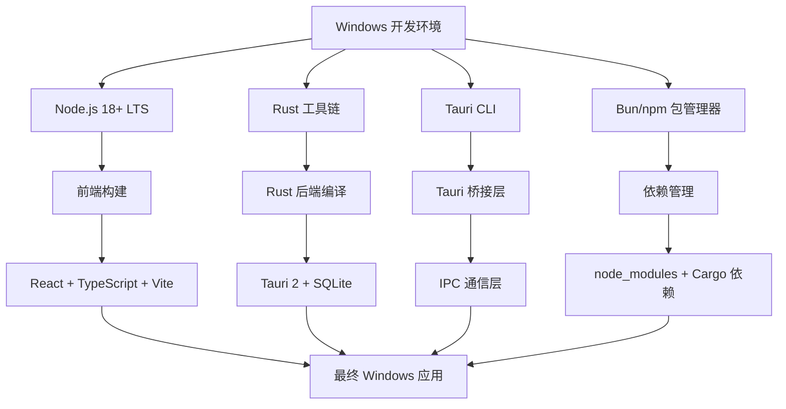

# Claude Suite Windows 编译指南规格文档

## 1. 需求规格 (Requirements Spec)

### 1.1 原始需求
用户需要了解如何在Windows平台上编译Claude Suite项目，生成可在Windows上运行的桌面应用程序。

### 1.2 任务边界
**包含范围:**
- Windows环境下的完整编译流程指导
- 必要的开发环境配置说明
- 多种构建方式的详细步骤
- 常见问题的解决方案
- 构建产物的说明和使用方法

**排除范围:**
- macOS和Linux平台的编译指导
- 源代码的功能性修改
- 新功能的开发
- 部署和分发策略

### 1.3 验收标准
1. **环境配置验收**: 用户能够成功配置所有必要的开发工具
2. **编译成功验收**: 能够无错误地完成项目编译
3. **功能验证验收**: 生成的Windows应用程序能够正常启动和运行
4. **文档完整性验收**: 提供清晰、完整、可操作的步骤说明

## 2. 设计规格 (Design Spec)

### 2.1 技术架构分析

### 2.2 构建方式设计
项目支持三种主要的构建方式：

1. **开发模式构建** (`bun run tauri dev`)
   - 用途: 开发调试
   - 特点: 热重载、调试工具、未优化

2. **生产模式构建** (`bun run tauri build`)
   - 用途: 正式发布
   - 特点: 完全优化、小体积、高性能
   - 产物: NSIS安装包、MSI安装包

3. **可执行文件构建** (`bun run scripts/build-executables.js`)
   - 用途: 单文件分发
   - 特点: 自包含、无需安装
   - 产物: 独立的.exe文件

### 2.3 关键决策点
- **包管理器选择**: 推荐使用Bun，备选npm
- **Rust版本**: 使用stable版本，确保兼容性
- **Windows目标**: 支持Windows 10/11 (64位)
- **构建优化**: 生产版本启用所有优化选项

## 3. 实施计划 (Implementation Plan)

### 3.1 高级任务拆分
1. **环境准备阶段**
   - 安装和配置Node.js
   - 安装和配置Rust工具链
   - 安装Tauri CLI
   - 安装包管理器(Bun推荐)

2. **项目准备阶段**
   - 克隆或获取项目源码
   - 安装项目依赖
   - 验证开发环境

3. **编译执行阶段**
   - 开发模式测试
   - 生产模式构建
   - 可执行文件生成

4. **验证和文档阶段**
   - 功能测试验证
   - 性能基准测试
   - 文档整理和优化

### 3.2 风险评估
- **低风险**: 标准的Tauri项目，技术栈成熟
- **潜在问题**: Windows特定的依赖冲突、Rust编译环境配置
- **缓解策略**: 提供详细的故障排除指南

### 3.3 成功指标
- 编译成功率: 100%
- 应用启动成功率: 100%
- 核心功能可用性: 100%
- 文档可操作性: 用户能够独立完成整个流程

## 4. 技术约束和依赖

### 4.1 系统要求
- **操作系统**: Windows 10 (1903+) 或 Windows 11
- **架构**: x64 (主要支持)
- **内存**: 最少4GB RAM，推荐8GB+
- **存储**: 至少2GB可用空间

### 4.2 软件依赖
- **Node.js**: 18.0+ LTS版本
- **Rust**: 最新stable版本
- **Visual Studio Build Tools**: 2019或更新版本
- **Git**: 用于源码管理

### 4.3 可选工具
- **Bun**: 推荐的包管理器和运行时
- **VS Code**: 推荐的开发环境
- **Windows Terminal**: 改善命令行体验

---

**文档版本**: v1.0  
**创建日期**: 2025-01-28  
**最后更新**: 2025-01-28  
**状态**: 待审批
