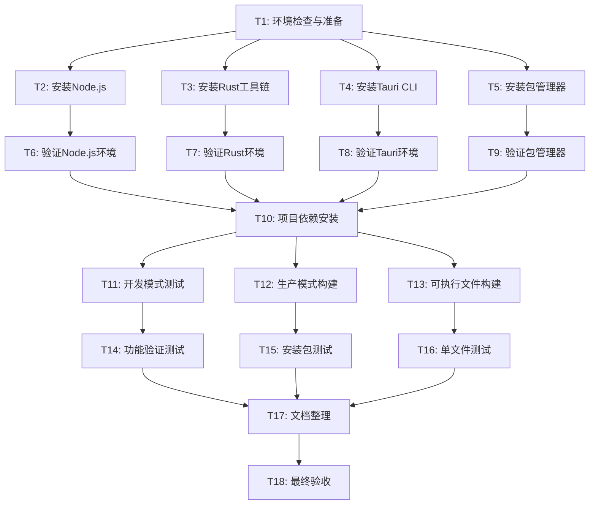

# Claude Suite Windows 构建任务分解

## 1. 任务依赖关系图

## 2. 原子任务详细定义

### T1: 环境检查与准备
**输入契约**: Windows 10/11 系统
**输出契约**: 系统环境评估报告
**实现约束**: 
- 检查Windows版本兼容性
- 验证系统架构(x64)
- 检查可用磁盘空间(>2GB)
- 检查内存容量(>4GB)
**依赖关系**: 无
**预估时间**: 10分钟
**验证标准**: 所有系统要求满足

### T2: 安装Node.js
**输入契约**: 通过环境检查的Windows系统
**输出契约**: Node.js 18+ LTS 安装完成
**实现约束**:
- 从官网下载LTS版本
- 使用默认安装选项
- 验证npm同时安装
**依赖关系**: T1
**预估时间**: 15分钟
**验证标准**: `node --version` 返回18+版本

### T3: 安装Rust工具链
**输入契约**: Windows系统准备就绪
**输出契约**: Rust stable工具链安装完成
**实现约束**:
- 使用rustup安装器
- 安装stable版本
- 包含cargo包管理器
- 配置Windows MSVC工具链
**依赖关系**: T1
**预估时间**: 20分钟
**验证标准**: `rustc --version` 和 `cargo --version` 正常输出

### T4: 安装Tauri CLI
**输入契约**: Rust工具链安装完成
**输出契约**: Tauri CLI v2 安装完成
**实现约束**:
- 使用cargo安装: `cargo install @tauri-apps/cli`
- 验证版本兼容性
**依赖关系**: T3
**预估时间**: 10分钟
**验证标准**: `tauri --version` 返回2.x版本

### T5: 安装包管理器(Bun推荐)
**输入契约**: Node.js环境准备就绪
**输出契约**: Bun包管理器安装完成
**实现约束**:
- 优先安装Bun
- 备选方案保持npm
- 配置全局可访问
**依赖关系**: T2
**预估时间**: 10分钟
**验证标准**: `bun --version` 正常输出

### T6-T9: 环境验证任务组
**输入契约**: 各自对应的安装任务完成
**输出契约**: 环境验证报告
**实现约束**: 运行版本检查命令，记录输出
**依赖关系**: T2-T5
**预估时间**: 5分钟/任务
**验证标准**: 所有工具版本符合要求

### T10: 项目依赖安装
**输入契约**: 所有开发工具验证通过
**输出契约**: 项目依赖完全安装
**实现约束**:
- 执行 `bun install` 或 `npm install`
- 安装前端依赖
- 自动触发Rust依赖下载
**依赖关系**: T6-T9
**预估时间**: 15分钟
**验证标准**: node_modules和Cargo.lock存在，无错误

### T11: 开发模式测试
**输入契约**: 项目依赖安装完成
**输出契约**: 开发服务器成功启动
**实现约束**:
- 执行 `bun run tauri dev`
- 验证应用窗口打开
- 测试基本功能
**依赖关系**: T10
**预估时间**: 10分钟
**验证标准**: 应用正常启动，无致命错误

### T12: 生产模式构建
**输入契约**: 开发模式验证通过
**输出契约**: 生产版本构建完成
**实现约束**:
- 执行 `bun run tauri build`
- 生成优化版本
- 创建安装包
**依赖关系**: T11
**预估时间**: 25分钟
**验证标准**: 构建成功，生成NSIS/MSI安装包

### T13: 可执行文件构建
**输入契约**: 项目依赖安装完成
**输出契约**: 单文件可执行程序生成
**实现约束**:
- 执行 `bun run scripts/build-executables.js windows`
- 生成自包含exe文件
**依赖关系**: T10
**预估时间**: 20分钟
**验证标准**: 生成claude-code-x86_64-pc-windows-msvc.exe

### T14-T16: 功能测试任务组
**输入契约**: 各自对应的构建任务完成
**输出契约**: 功能验证报告
**实现约束**:
- 安装/运行构建产物
- 测试核心功能
- 记录性能指标
**依赖关系**: T11-T13
**预估时间**: 15分钟/任务
**验证标准**: 所有核心功能正常工作

### T17: 文档整理
**输入契约**: 所有测试任务完成
**输出契约**: 完整的构建指南文档
**实现约束**:
- 整理构建步骤
- 记录常见问题解决方案
- 创建用户友好的指南
**依赖关系**: T14-T16
**预估时间**: 30分钟
**验证标准**: 文档完整、准确、可操作

### T18: 最终验收
**输入契约**: 所有前置任务完成
**输出契约**: 项目交付验收报告
**实现约束**:
- 全流程回顾
- 质量指标检查
- 交付物确认
**依赖关系**: T17
**预估时间**: 15分钟
**验证标准**: 满足所有验收标准

## 3. 风险评估与缓解

### 高风险任务
- **T3 (Rust安装)**: Windows MSVC工具链配置复杂
- **T12 (生产构建)**: 编译时间长，可能出现优化问题

### 缓解策略
- 提供详细的故障排除指南
- 准备备选安装方案
- 设置合理的超时时间

## 4. 质量门控

每个任务完成后必须通过以下检查：
- [ ] 输出契约完全满足
- [ ] 验证标准全部通过
- [ ] 无阻塞性错误
- [ ] 文档记录完整

---

**任务版本**: v1.0  
**总预估时间**: 3-4小时  
**并行度**: 部分任务可并行执行  
**状态**: 待审批
